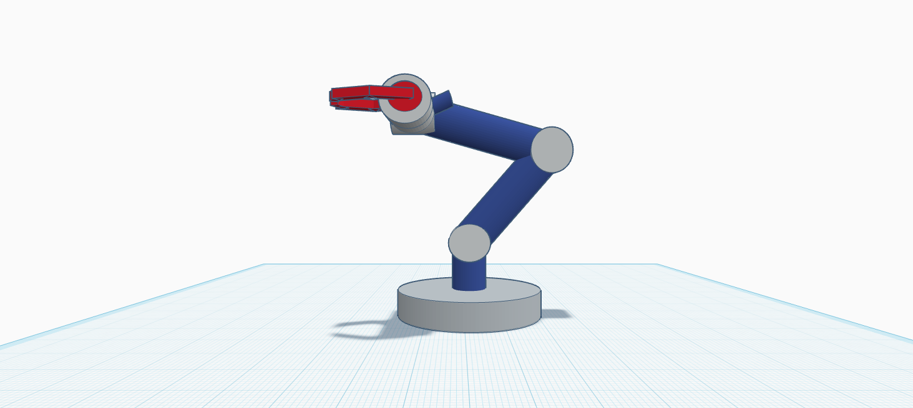
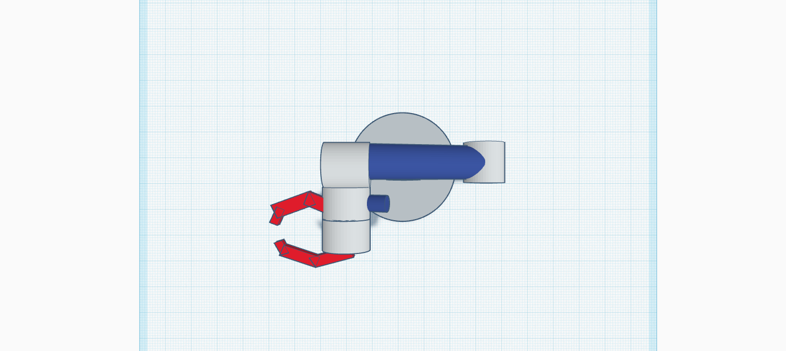
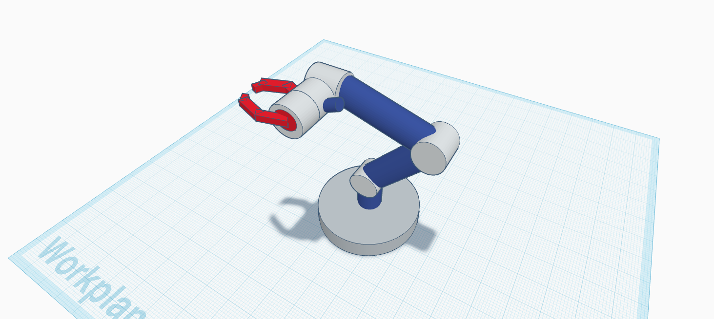

# 🤖 5-DOF Robotic Arm

This project is a 3D model of a **robotic arm with 5 degrees of freedom (DOF)**, created using **Tinkercad**. It demonstrates the basic motion and structure of robotic arms used in industrial and educational environments.

---

## 🎯 Objectives

- Understand the structure of robotic arms.
- Learn how to identify and model 5 degrees of freedom.
- Simulate real-world robotic arm movement in a simplified way.

---

## 🦾 Degrees of Freedom (DOF)

| # | Movement Type               | Description |
|---|-----------------------------|-------------|
| 1 | **Base Rotation (Yaw)**     | The entire arm rotates on its circular base. |
| 2 | **Shoulder Joint (Pitch)**  | The lower blue arm segment moves up/down. |
| 3 | **Elbow Joint (Pitch)**     | The upper blue arm segment moves up/down. |
| 4 | **Wrist Rotation (Roll)**   | The gripper can rotate around its axis via a small joint. |
| 5 | **Gripper Open/Close**      | The red claws open and close to grasp objects. |

---

## 🛠 Tools Used

- [Tinkercad](https://www.tinkercad.com) – For 3D modeling and simulation
- Screenshots – Captured directly from Tinkercad

---

## 📸 Screenshots

---

## 📦 How to Recreate the Model

1. Visit [Tinkercad](https://www.tinkercad.com).
2. Click “Create new design”.
3. Use:
   - **Cylinders** for joints and base
   - **Boxes** for arm links
   - **Custom shapes** for the gripper
4. Arrange and align using the “Align” and “Group” tools.
5. Add a small cylinder between the arm and the gripper for wrist rotation.

---

## ✨ What I Learned

- The concept of degrees of freedom in robotics.
- How to simulate mechanical movement in 3D.
- How to model real-world mechanisms using simple shapes.

---

## 📌 Notes

- This is a static 3D model (no motors or programming).
